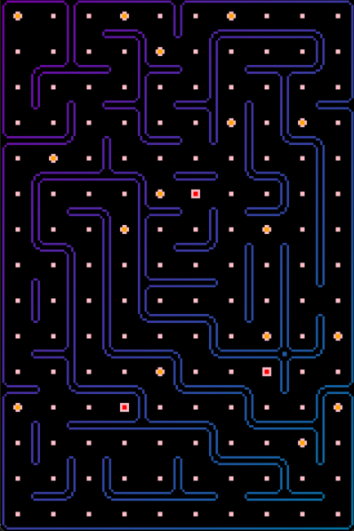

# RTL-Maze

Game for FPGA

## Simulation V1

It is outdated version of simulation, written in python.

## Simulation V2

It is last version of simulation, that uses C++ and verilator.

To run it just use `make` command in **screen_simulation_2** folder.

## Synthesis

**Usage of Quartus is expected!**

To synthesize and upload project just use `make TARGET=[name]` in root directory of the project.

This make script creates Maze.qsf with necessary settings and uses pins assignments from **pins_config**.

And then synthesize and upload it via USB Bluster. 

If you want to just create quartus settings file, use `make init TARGET=[name]`.

Available names list:

- **C7** for EP4CE115F29C7

- **C8** for EP4CE6E22C8
